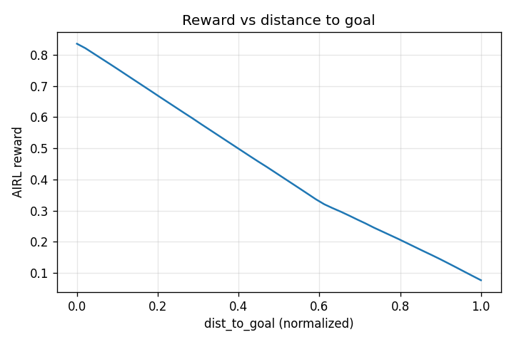
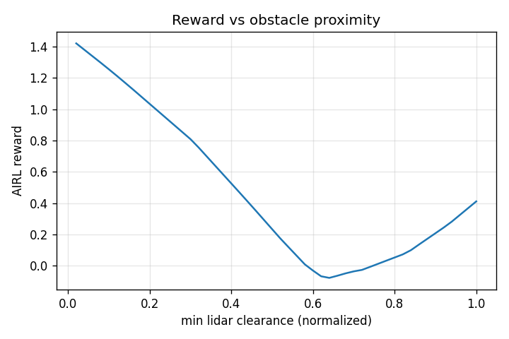
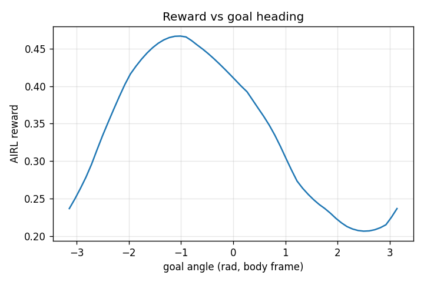

# rl_on_wheels

https://github.com/user-attachments/assets/d807a534-3d17-4f3a-8efa-861af5b8f4ba

Goal-conditioned mobile robot navigation on TurtleBot3 Waffle Pi
in ROS2 Humble + Ignition Fortress (Gazebo Sim). Same env, same 2D LiDAR
input across all approaches (360 rays → 36 normalised bins, optionally
frame-stacked). No cameras.

Three approaches are implemented end-to-end and compared:

- **Behavior Cloning + DAgger** — imitate a Nav2 expert from ros2 bag
  demos, then close the covariate-shift gap with iterative DAgger
  relabeling. **84 %** success on stage 4, **62 %** on stage 5.
- **Inverse RL (AIRL)** — recover an interpretable reward function from
  the same Nav2 demos, then optimise a fresh PPO against the frozen
  recovered reward. Reaches **50 %** on stage 5 — matches BC but does
  not exceed it. Documents the structural ceiling of pure imitation-
  based IRL on a single-sim 10 Hz training budget.
- **Model-free RL** — TD3 baseline (canonical). SAC + HER was implemented
  as the initial baseline (`rl/agents/sac_her_agent.py`,
  `configs/sac_her.yaml`) before switching to TD3 mid-project for
  simpler off-policy training without HER's goal-relabeling overhead.
  Curriculum experiments use TD3 only — SAC was not rerun on the new
  stages.

### Headline result (stage 5, 50-episode deterministic eval)

| Method | Success | Notes |
| ------ | ------- | ----- |
| Nav2 expert (demo source) | 89 % | upper bound from the demonstrator itself |
| **BC + frame-stack + safety overrides** | **62 %** | strongest learned policy |
| BC alone (matched eval, no overrides) | 52 % | imitation baseline |
| Phase-2 PPO + frozen AIRL reward | 50 % | matches BC; doesn't exceed |
| Adversarial AIRL | 46 % | adversarial loop matches BC within noise |

The honest story: **on this slow single-sim training budget, BC is the
strongest tool for raw policy quality, while AIRL contributes an
interpretable reward function but no policy improvement.** See the
[Inverse RL](#inverse-rl-airl) section for the full discussion.

---

## Repository layout

```
rl_on_wheels/
├── docker/                          ROS2 Humble + Ignition Fortress image
├── ros2_ws/src/tb3_rl_bridge/       C++ ROS2 package (sim bridge)
│   ├── srv/                         GetObservation, Step, ResetEpisode
│   ├── src/
│   │   ├── env_bridge_node.cpp      obs assembly, reward, done detection
│   │   ├── reset_node.cpp           teleport + per-stage goal sampling
│   │   └── dynamic_obstacle_node.cpp keyframe-driven moving cylinders
│   ├── worlds/tb3_stage{1..5}.sdf   per-stage Ignition world files
│   └── launch/bridge.launch.py      starts sim + bridge nodes
├── ros2_ws/src/tb3_nav2/            Nav2 stack for BC demo collection
│   ├── src/
│   │   ├── pose_publisher_node.cpp  map→odom TF from Ignition ground-truth
│   │   └── goal_forwarder_node.cpp  /goal_pose → /navigate_to_pose action
│   ├── config/nav2_params.yaml      planner + controller tuning
│   ├── maps/tb3_stage{1..5}.{pgm,yaml}   rasterised occupancy grids
│   ├── tools/gen_maps.py            generates the PGMs from wall specs
│   └── launch/nav2_bringup.launch.py  Nav2 lifecycle bringup
├── bc/                              Behavior cloning + DAgger
│   ├── build_dataset.py             ros2 bag → NPZ training set
│   ├── networks.py                  MLP policy with tanh output
│   ├── train.py                     supervised MSE on (obs, action) pairs
│   ├── eval.py                      deterministic rollout with safety guards
│   ├── run_episodes.py              drive Nav2 through N episodes
│   ├── dagger_collect.py            BC drives, Nav2 silently relabels
│   ├── dataset_merge.py             concat base demos + DAgger NPZs
│   ├── dagger_iterate.sh            collect → merge → train loop
│   └── inspect_dataset.py           sanity-check action distributions
├── airl/                            Inverse RL via AIRL (HumanCompatibleAI imitation lib)
│   ├── convert_demos.py             BC NPZ → imitation Trajectory pickle
│   ├── train_airl.py                BC pretraining + AIRL adversarial loop
│   ├── train_with_reward.py         phase 2: PPO against frozen recovered reward
│   ├── eval_policy.py               50-ep eval for SB3 PPO checkpoints
│   └── inspect_reward.py            probe recovered reward over obs sweeps
├── rl/                              Model-free RL pipelines (TD3 / SAC / PPO)
│   ├── envs/ros2_gym_env.py         gymnasium Env wrapper
│   ├── agents/{sac_her,td3,ppo}_agent.py
│   ├── train.py / train_td3.py / train_ppo.py
│   └── eval.py
├── configs/{bc,td3,sac_her,ppo}.yaml hyperparameters + env settings
└── scripts/launch_sim.sh            in-container sim launcher
```

---

## Prerequisites

- **Docker ≥ 24** and **Docker Compose v2**
- **NVIDIA GPU** + [NVIDIA Container Toolkit](https://docs.nvidia.com/datacenter/cloud-native/container-toolkit/install-guide.html)
- **X11 display** for Ignition GUI (native Linux desktop)

Verify GPU passthrough:
```bash
docker run --rm --gpus all nvidia/cuda:12.0-base nvidia-smi
```

---

## Quickstart

### 1. Build the Docker image (one-time)

```bash
docker compose -f docker/docker-compose.yml build
```

### 2. Allow X11 access (host side)

```bash
xhost +local:root
```

### 3. Terminal 1 — launch the simulator

Get a shell inside the sim container, then launch the bridge for your chosen stage:

```bash
docker compose -f docker/docker-compose.yml run --rm --name sim sim bash
```

Inside the container:

```bash
source /opt/ros/humble/setup.bash
source /ros2_ws/install/setup.bash
ros2 launch tb3_rl_bridge bridge.launch.py stage:=4
```

### 4. Terminal 2 — run training

In a new host terminal, exec into the same container and run training:

```bash
docker exec -it sim bash
```

Inside the container:

```bash
# Fresh run
python3 /rl/train_td3.py --config /configs/td3.yaml

# Resume from a checkpoint
python3 /rl/train_td3.py --config /configs/td3.yaml \
    --checkpoint /checkpoints/td3_tb3_214000_steps
```

### 5. Rebuild after C++ changes

If you edit any `.cpp` under `tb3_rl_bridge/src/`, open a third terminal:

```bash
docker exec -it sim bash
cd /ros2_ws && colcon build --packages-select tb3_rl_bridge
source install/setup.bash
# then Ctrl-C the ros2 launch in Terminal 1 and re-run it
```

### 6. TensorBoard

From any container shell (host networking is on, so `localhost:6006` works from the host browser):

```bash
tensorboard --logdir /logs/tensorboard --host 0.0.0.0
```

### 7. Evaluate a checkpoint

In a container shell:

```bash
python3 /rl/eval.py --config /configs/td3.yaml \
    --checkpoint /checkpoints/td3_tb3_214000_steps
```

---

## Switching methods

| Method | Config | Train script | TensorBoard port |
|--------|--------|--------------|-------|
| BC + DAgger | `configs/bc.yaml` | `bc/train.py`, `bc/dagger_iterate.sh` | 6006 |
| AIRL (inverse RL) | `configs/airl.yaml` | `airl/train_airl.py` + `airl/train_with_reward.py` | 6006 |
| TD3 | `configs/td3.yaml` | `rl/train_td3.py` | 6007 |
| SAC (early prototype) | `configs/sac_her.yaml` | `rl/train.py` | 6006 |
| PPO | `configs/ppo.yaml` | `rl/train_ppo.py` | — |

---

## Behavior Cloning + DAgger

The BC pipeline imitates a Nav2 expert collected via `ros2 bag`, then closes
the covariate-shift gap with DAgger relabeling. The policy is a small MLP
(`[512, 512]`, tanh head) trained on supervised `(obs → action)` pairs.

### Pipeline

```
1. Demo collection      Nav2 drives N episodes in stage X.
                        bag records /scan /odom /robot_world_pose
                                    /goal_pose /cmd_vel
2. Dataset build        ros2 bag → NPZ
                        (obs[40], action[2], ep_id) per cmd_vel.
3. Supervised train     MSE on tanh(action), 4-frame stacking.
4. (optional) DAgger    BC drives → Nav2's /cmd_vel_expert relabels →
                        append to NPZ → retrain. Repeat 1-3 iters.
5. Eval                 Deterministic rollout with safety guards
                        (front + side clearance, near-goal P-controller).
```

### Quickstart (inside the sim container)

```bash
# Terminal A — sim
ros2 launch tb3_rl_bridge bridge.launch.py stage:=4 dynamic_obstacles:=true

# Terminal B — Nav2 (for demo collection)
ros2 launch tb3_nav2 nav2_bringup.launch.py stage:=4

# Terminal C — record the bag
ros2 bag record -o /demos/stage4_nav2 \
    /scan /odom /robot_world_pose /goal_pose /cmd_vel

# Terminal D — drive 300 episodes
PYTHONPATH=/:$PYTHONPATH python3 /bc/run_episodes.py --episodes 300

# After collection: build dataset + train + eval
PYTHONPATH=/:$PYTHONPATH python3 /bc/build_dataset.py \
    --bag /demos/stage4_nav2 --out /demos/stage4_bc.npz \
    --goal-tolerance 0.45
PYTHONPATH=/:$PYTHONPATH python3 -m bc.train \
    --config /configs/bc.yaml --dataset /demos/stage4_bc.npz
PYTHONPATH=/:$PYTHONPATH python3 /bc/eval.py \
    --checkpoint /checkpoints/bc_best.pt --episodes 50
```

DAgger iterations re-use the same sim and add Nav2 in **shadow mode**
(`dagger_mode:=true`) so its actions are published to `/cmd_vel_expert`
while BC drives `/cmd_vel`. Then:

```bash
PYTHONPATH=/:$PYTHONPATH python3 /bc/dagger_collect.py \
    --checkpoint /checkpoints/bc_best.pt \
    --out /demos/dagger_iter1.npz --episodes 200
PYTHONPATH=/:$PYTHONPATH python3 /bc/dataset_merge.py \
    --inputs /demos/stage4_bc.npz /demos/dagger_iter1.npz \
    --out    /demos/stage4_dagger_agg1.npz
PYTHONPATH=/:$PYTHONPATH python3 -m bc.train \
    --config /configs/bc.yaml --dataset /demos/stage4_dagger_agg1.npz
```

`bc/dagger_iterate.sh` wraps the full loop for N iterations.

### Results (50-episode eval, deterministic rollout)

#### Stage 4 — 5×5 m maze + 2 dynamic cylinders (canonical training stage)

| Stage of training              | Success | Mean reward | Mean len |
| ------------------------------ | ------- | ----------- | -------- |
| Base BC only                   |  28 %   | −1271       | 264      |
| DAgger iter 1                  |  50–60 %|             |          |
| DAgger iter 2                  |  84 %   | +1326       | 204      |
| **+ Frame stacking (final)**   |  80 %   | +1207       | 168      |

The frame-stacked policy ends slightly below iter 2 in raw % but with
honest collision-avoidance (no wall-grazes that the env's coarse
collision check otherwise accepts as successes). Mean episode length
drops 17 %, so the successes are also faster.

#### Stage 5 — 7×7 m maze + 6 dynamic cylinders (generalization probe)

A bigger, denser maze. The 5×5 lidar/arena ratio that worked on stage 4
gets too sparse at 7×7, so the lidar hardware max is bumped to 6.0 m
for this stage. Eval-time safety thresholds auto-scale with
`max_lidar_range` so the physical clearance stays at 0.45 m.

| Config                                        | Success | Mean reward | Mean len |
| --------------------------------------------- | ------- | ----------- | -------- |
| 3.5 m lidar, base BC                          |  32–42 %| −1102       | 244      |
| 3.5 m lidar, after DAgger iter 1              |  ~10 %  |             |          |
| **6 m lidar + scaled safety + final-approach P-controller** | **62 %** | **+154** | **200** |

Stage 5 is intentionally harder than stage 4 — bigger arena, 3× the
dynamic obstacles, longer corridors. DAgger iteration 1 on stage 5
*hurt* the policy at the 3.5 m lidar config because BC's failure
trajectories explored states too far off the demo manifold for Nav2's
relabels to recover from. The 6 m lidar lets BC see further → fewer
off-manifold visits during DAgger collection → cleaner labels in
future iterations.

---

## Inverse RL (AIRL)

The IRL pipeline asks a different question than BC: instead of "what
action would the expert take?", it asks "**what reward function would
make the expert's behavior look optimal?**". The output is an
interpretable reward function that BC cannot produce. Built on top of
the [HumanCompatibleAI `imitation`](https://github.com/HumanCompatibleAI/imitation)
library + SB3 PPO.

### Pipeline

```
1. Demo conversion        BC NPZ (40-dim obs + actions + ep_id) →
                          imitation.Trajectory pickle.
2. BC pretraining         Warm-start PPO's policy on demos for 20
                          epochs (imitation.algorithms.bc.BC). Without
                          this, PPO starts random and the discriminator
                          immediately wins, reward curve descends
                          monotonically.
3. AIRL adversarial loop  Train discriminator vs PPO. Discriminator
                          score → reward signal for PPO. Repeat.
                          BasicShapedRewardNet with running input norm.
4. (phase 2)              Freeze recovered reward. Train fresh PPO from
                          BC warm-start against just that reward, no
                          more adversarial drift.
5. Inspect reward         Sweep recovered reward over interpretable obs
                          axes (dist-to-goal, lidar clearance, goal
                          angle) → PNG plots.
```

### Quickstart (after BC NPZ exists)

```bash
# 1. convert demos
PYTHONPATH=/:$PYTHONPATH python3 /airl/convert_demos.py \
    --npz /demos/stage5_bc_6m.npz \
    --out /demos/stage5_trajectories.pkl

# 2. AIRL (BC pretrain + adversarial)
PYTHONPATH=/:$PYTHONPATH python3 /airl/train_airl.py \
    --config /configs/airl.yaml \
    --trajectories /demos/stage5_trajectories.pkl \
    --total-timesteps 60000 --bc-epochs 20 \
    --out-dir /checkpoints/airl_stage5

# 3. phase 2: PPO against frozen recovered reward
PYTHONPATH=/:$PYTHONPATH python3 /airl/train_with_reward.py \
    --reward-net /checkpoints/airl_stage5/reward_net.pt \
    --init-policy /checkpoints/airl_stage5/policy_after_bc.zip \
    --total-timesteps 200000 \
    --out-dir /checkpoints/airl_phase2_stage5

# 4. inspect the recovered reward
PYTHONPATH=/:$PYTHONPATH python3 /airl/inspect_reward.py \
    --checkpoint-dir /checkpoints/airl_stage5 \
    --out-dir /logs/airl_reward_inspect
```

### Results (50-episode eval, stage 5)

| Variant | Success | Mean reward | Mean len |
| ------- | ------- | ----------- | -------- |
| Adversarial AIRL (default LR=3e-4) | 16 % | −1608 | 188 |
| Adversarial AIRL (low LR=3e-5, BC warm-start) | 46 % | −196 | 121 |
| **Phase 2 — PPO + frozen recovered reward** | **50 %** | **+17** | **111** |
| BC alone (matched eval conditions) | 52 % | +66 | 115 |

### What we found

1. **The recovered reward function is interpretable.** Sweep plots over
   dist-to-goal, lidar clearance, and goal-angle show structures
   consistent with what Nav2 implicitly optimises — reward increases
   monotonically as distance-to-goal decreases, drops sharply when min
   lidar clearance approaches the collision threshold, peaks when the
   goal is in front of the robot. *This is the IRL contribution* —
   something BC simply cannot produce.

   <p align="center">
     
     
     
   </p>

2. **Adversarial AIRL is highly sensitive to PPO learning rate.** With
   the default SB3 PPO LR (3e-4), the BC warm-start gets destroyed by
   the first few PPO updates and the discriminator dominates from then
   on — reward curve descends monotonically, final policy hits 16 %.
   Dropping LR 10× to 3e-5 preserves BC quality long enough for the
   discriminator to learn against a *good* policy; final 46 %.

3. **Phase 2 (frozen reward + fresh PPO) matches but doesn't exceed
   BC.** 50 % vs BC's 52 % — within the binomial confidence interval on
   50 episodes. This is the structural ceiling of pure imitation-based
   IRL: the reward function rewards "looks like Nav2," so optimal
   policies under it look like Nav2, capping at expert quality.

4. **Frame stacking helps BC but hurts AIRL on this setup.** Adding 4×
   frame-stacking pushed BC from 52 % → 62 %; the same change applied
   to the AIRL pipeline collapsed it back to 16 % (adversarial) and
   10 % (phase 2). The 4× larger input means the discriminator and
   policy nets have more capacity than the demo set + training budget
   can fit cleanly. Documented in commit history; the current AIRL
   pipeline supports frame stacking via `--frame-stack k` but defaults
   to 1.

### Honest framing

The IRL angle of the project produced a **working pipeline** and an
**interpretable artifact** (the reward function) but **not a policy
that exceeds the BC baseline** on this compute budget. Pure imitation-
based methods cannot exceed the expert without hybridising with a true
task reward signal (which would no longer be "pure IRL"). Three places
the result could be pushed further if compute were available:
parallel vec-envs to reach the millions-of-steps regime AIRL papers
use, off-policy AIRL variants like DAC (SAC instead of PPO), or
hybrid AIRL + env-reward training.

---

## Architecture

```
Python (train_td3.py)
    │  gym.step(action)
    ▼
TurtleBot3Env  ──── ROS2 services ────►  env_bridge_node (C++)
                                              │  /cmd_vel ──► Ignition
                                              │  /scan, /odom ◄── Ignition
                                              │  /goal_pose  ◄── reset_node
                                              │  /obstacle_poses ◄── dynamic_obstacle_node
                                              └── world-frame robot pose
                                                  ◄── Ignition /dynamic_pose/info
```

### ROS2 services

| Service | Direction | Description |
|---------|-----------|-------------|
| `/step` | Python → C++ | apply action, wait `step_duration`, return (obs, reward, done) |
| `/get_observation` | Python → C++ | read current sensor state |
| `/reset_episode` | Python → C++ | teleport robot + spawn new goal |

### Observation vector

`env_bridge_node` emits a 42-dim observation:

```
[lidar_0 … lidar_35]    36 × normalised LiDAR ∈ [0, 1]    (robot frame)
[dist_norm]              distance to goal / max_lidar_range
[cos_goal_body]          cosine of goal heading in robot frame
[sin_goal_body]          sine   of goal heading in robot frame
[goal_path_min]          min LiDAR in ±20° cone around goal direction
[prev_lin_vel]           previous linear  velocity
[prev_ang_vel]           previous angular velocity
```

**BC slices off the last two dims** (`prev_lin_vel`, `prev_ang_vel`)
before feeding the policy — they form an action-echo feedback loop
where the policy reproduces the previous action regardless of state.
BC therefore sees 40 dims. Optionally, `bc/train.py` stacks the last
`frame_stack` observations (default 4) for temporal context — input
becomes 160-dim. See `configs/bc.yaml: bc.frame_stack`.

### Reward (current TD3 setup)

Per-step shaping plus large terminal bonuses:

```
reward = r_yaw + r_vangular + r_vlinear + r_distance + r_obstacle − 1

terminal: +2500 on goal reached, −2000 on collision
```

| Term | Range | Purpose |
|------|-------|---------|
| `r_yaw = -abs(goal_angle)` | [−π, 0] | face the goal |
| `r_vangular = -ω²` | [−4, 0] | discourage spinning |
| `r_vlinear = -((v_max − v) × 10)²` | [−~5, 0] | encourage forward motion |
| `r_distance = 2·d₀/(d₀ + d) − 1` | [−1, 1] | shape progress toward goal |
| `r_obstacle = -20 if min_obs_dist < 0.22m else 0` | {0, −20} | avoid moving cylinders |

Wall proximity is handled via the collision termination (`-2000`),
not via `r_obstacle` — only moving cylinders trigger that penalty.

---

## License

MIT
